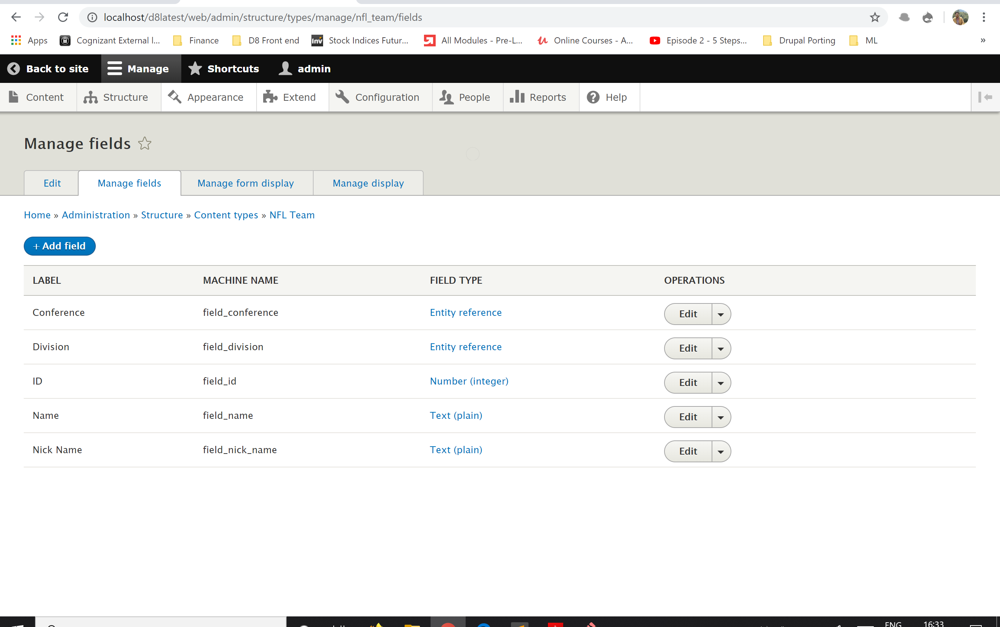

# JSON-API-data-viewer
Repo showing the steps to read data from JSON API and show it in readable format

## Planning:
* The main requirement is to pull in data from JSON API and show it in Drupal 8. Below are various steps which we need to do in order to achieve this.
* I shall first explain on the steps to justify my approach and give you more detailed screenshots and code for each step.

### Step 1 - Pull data to Drupal:  
Pull in the data from JSON API and show it in Drupal site or store the data in Drupal site in order to show it. 

* In this case, though showing the data without storing can save space in database, allowing the data to be stored as content type in Drupal 8 will give us the flexibility to show in any form in Drupal.

* I am going to use the Feeds and Feeds Extensible parsers module in order to get the data and store it as a content type in Drupal.

**Why feeds module?**

Feeds module allows us to periodically get the data and refresh it in our content type without our intervention. Once stored in Content type we can use Views module to show the data in any format. 

**Why not Views Query Plugin?**

We can also write a Views Query Plugin to parse the data from API and render it in views. But it requires a lot of custom Plugin code which needs to be tested for correctness. Instead we can use existing contributed modules like Feeds which are already tested and used by multiple sites. In this way we get upgraded versions of the module for Drupal 9 too. If we are writing custom code, we need to make sure the upgrade for future Drupal 
versions are done by us which needs more time to be invested in future.

### Step 2 - Show data in Drupal: 
The next step is deciding on how the data is going to be showed to the user.

Below are some facts about the given data:
1. The data given is structured.
2. The data has less number of fields and most of them are categorical fields.
3. Separating the data into different pages will not show a holistic view of the data and listing them on below another will again not show any overall view of the data

Based on above facts I decide to show the data in Table format with filtering option. This will give a holistic view of the data and at same time also allow us to filter and see data we need.

The module I am going to use is Data Tables.

**Why Data Tables?**

This provides us responsive table view along with the option to filter our data

### Step 3 – Package the solution into a portable one:
There are different set of configurations involved in above solution. So it is always necessary we have this portable so that this can be moved to different environments and also re-used in different sites. Features module will solve this purpose.

**Why Features?**

Feature will allow us to bundle below configuration into one.
1. The content type used to store the JSON API data.
2. The Feeds used to pull and refresh the JSON API data.
3. The Views and Data Tables configuration to show the data

## Implementation:
Enough of theory; let us dive into implementation right away for each step.

### Step 1 - Pull data to Drupal:

**Pre-requisite**: The Feeds and Feeds extensible parsers module are installed using composer as below.

`composer require drupal/feeds_ex`

Let us create the underlying content type to store the data from JSON API. Below is the content type with fields.

You can see that Conference and Division are entity reference since they have repeated values to choose from. Also the *display_name* field shall be mapped to default *Title* field in Drupal.

Let us now configure the Feeds type to import the JSON data to the content type create above.

Below is the basic configuration for the Feeds followed by fetcher and processor settings.

The next important step is doing the mapping as below.

After this is done I have added the feed under Content->Feeds. Below is the added feed.

The above feed will automatically pull the data on set interval. Once the feed is added click on *Save and Import* button. This will import the feed and create content in Drupal as shown below.

Below is example content.

Thats it! We have successfully configured Drupal to pull in content from given JSON API.

### Step 2 - Show data in Drupal: 
First download the Data Tables module from https://www.drupal.org/project/datatables using composer. Also make sure the Data Tables library is put inside the */libraries* folder of Drupal.

`composer require drupal/datatables`

Now let us create a view using Data Tables to show the data in a redable format for the user. Below is the screenshot of the view configuration.

Once the views is done, navigate to the page and you can see the table displayed with searching and pagination options as shown below.

Filtering will show only that data in table.

As you can see the data can also be exported in different formats using the buttons above the table.

And we are done with step-2. Now let us proceed with packaging our solution into a module.
